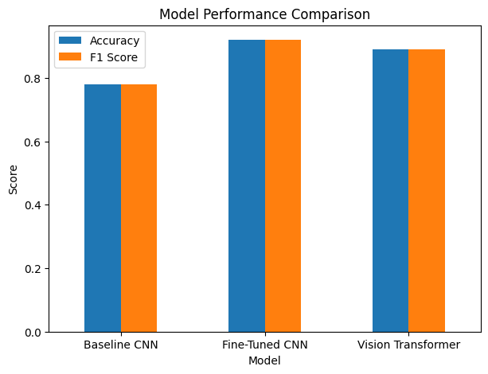
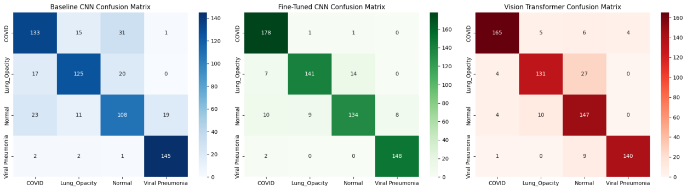
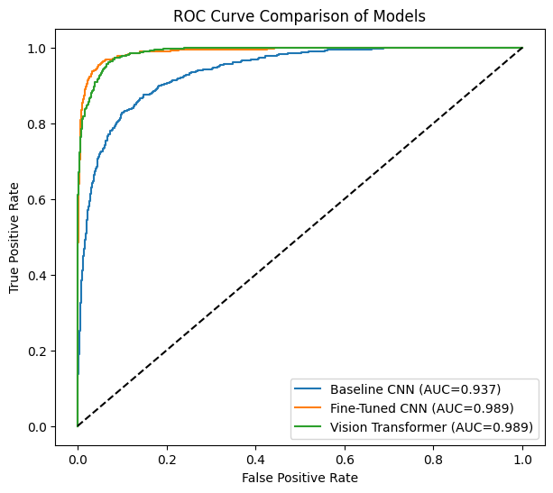
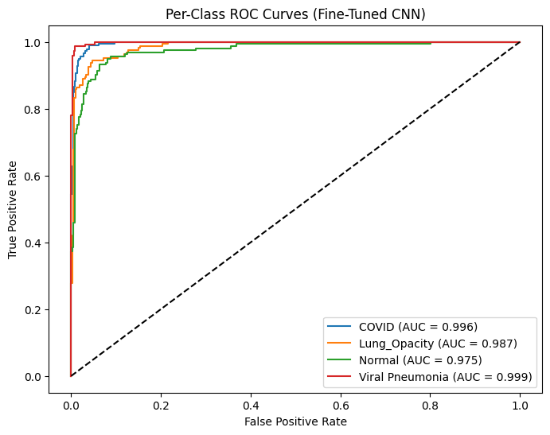
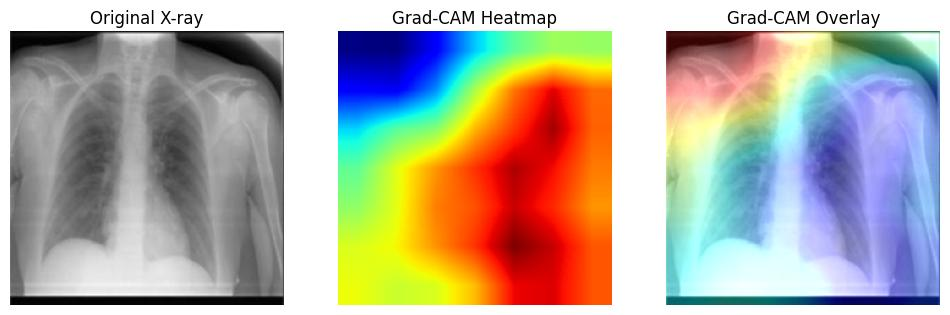
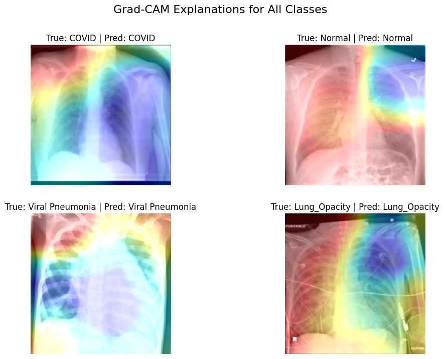

# Comparative Analysis of CNNs and Vision Transformers for Multi-Class Lung Abnormality Classification

MSc Data Science and Computational Intelligence — 7151CEM Computing Individual Research Project
Coventry University, School of Science

**Author:** Adabala Sri Satya Sai Shanmukha Charan (SID: 15996037)
**Supervisors:** Michael Macaulay, Nahid Salimi

## Overview

This project compares three deep learning architectures for classifying chest X-ray images into four categories — **COVID-19, Lung Opacity, Normal, and Viral Pneumonia** — and uses Grad-CAM to check whether the models' predictions are based on clinically meaningful lung regions.

| Model | Architecture | Training Strategy |
|---|---|---|
| Baseline CNN | ResNet50 | Convolutional layers frozen, only final layer trained |
| Fine-Tuned CNN | ResNet50 | All layers trainable |
| Vision Transformer | ViT-B16 | All layers trainable |

## Dataset

~4,350 chest X-ray images across four balanced classes:

| Class | Images |
|---|---|
| Viral Pneumonia | 1,050 |
| Normal | 1,000 |
| Lung Opacity | 1,200 |
| COVID | 1,100 |

Split 70:15:15 into training (3,045), validation (652), and test (653) sets.

*Note: the dataset itself is not included in this repository — see [Reproducing this project](#reproducing-this-project) below.*

## Experimental Setup

All three models were trained and evaluated under **identical conditions** so that any performance difference reflects the architecture, not the pipeline:

| Setting | Value |
|---|---|
| Input size | 224 × 224 |
| Channel conversion | Grayscale → 3-channel RGB (replicated) |
| Train / Val / Test split | 70% / 15% / 15% |
| Batch size | 32 |
| Optimiser | Adam |
| Learning rate | 1 × 10⁻⁴ |
| Loss function | Cross-Entropy Loss |
| Epochs | 5 |
| Hardware | Google Colab, T4 GPU |
| Data shuffling | Training set shuffled; validation/test sets fixed |

## Results

| Model | Accuracy | F1 Score | ROC-AUC |
|---|---|---|---|
| Baseline CNN | 0.78 | 0.78 | 0.937 |
| **Fine-Tuned CNN** | **0.92** | **0.92** | **0.989** |
| Vision Transformer (ViT-B16) | 0.89 | 0.89 | 0.989 |



The fine-tuned CNN gave the strongest overall performance, with near-perfect recall for COVID (178/180) and Viral Pneumonia (148/150). The Vision Transformer was competitive on AUC but showed more confusion between Lung Opacity and Normal cases, consistent with transformers needing larger datasets to realise their full potential.

### Confusion Matrices



The baseline CNN shows the most confusion between COVID/Normal and Lung Opacity/Normal. Fine-tuning sharply reduces misclassification, while the Vision Transformer sits in between, struggling most with Lung Opacity vs. Normal (27 misclassified cases).

### ROC Curve Analysis



All three models clear the random-classification baseline. The fine-tuned CNN and Vision Transformer both reach an AUC of ~0.989, though the fine-tuned CNN converts that into higher raw accuracy.



Per-class breakdown for the fine-tuned CNN: COVID (0.996), Lung Opacity (0.987), Normal (0.975), Viral Pneumonia (0.999) — the Normal class is the hardest to separate cleanly, since it borders on mild/early-stage abnormalities.

### Explainability (Grad-CAM)





Grad-CAM heatmaps on the fine-tuned CNN show attention concentrated on the lung fields rather than irrelevant areas of the image, supporting the interpretability and clinical plausibility of the model's predictions.

## Key Findings

- Fine-tuning the full ResNet50 backbone improved accuracy by 14 percentage points over the frozen baseline (0.78 → 0.92), confirming that domain-specific adaptation matters more than relying on generic ImageNet features for chest X-ray classification.
- The Vision Transformer reached a comparable AUC (~0.989) to the fine-tuned CNN but converted that into lower raw accuracy (0.89 vs 0.92), with most of its errors concentrated in Lung Opacity vs. Normal confusion — consistent with ViTs needing larger datasets to fully exploit their lack of spatial inductive bias.
- Across all three models, Normal was the hardest class to separate cleanly (lowest per-class AUC on the fine-tuned CNN, 0.975), since it borders mild/early-stage abnormalities rather than clearly diseased tissue.
- Grad-CAM heatmaps on the fine-tuned CNN consistently highlighted lung fields rather than background or artefact regions, suggesting the model's predictions are driven by clinically plausible features rather than shortcut learning.

## Demo App

A minimal Streamlit app (`app/app.py`) demonstrates the inference pipeline: upload a chest X-ray, get a predicted class and per-class confidence scores from the fine-tuned CNN.

```bash
streamlit run app/app.py
```

Requires a trained checkpoint at the path set in `src/config.py` (`MODEL_SAVE_PATH`) — run `python main.py` first to produce one, or point the config at your own.

*This is a research demo, not a clinical tool — see [Limitations](#limitations) below.*

## Repository Structure

```
.
├── app/
│   └── app.py             # Streamlit demo — upload an X-ray, get a prediction
├── notebooks/
│   └── lung_abnormality_classification.ipynb   # Full interactive pipeline (EDA → training → Grad-CAM)
├── src/
│   ├── config.py       # Paths, hyperparameters, device setup
│   ├── data.py           # Dataset loading, preprocessing, train/val/test split
│   ├── eda.py             # Class distribution, pixel intensity, brightness, edge detection
│   ├── models.py       # Baseline CNN / Fine-Tuned CNN / ViT-B16 builders
│   ├── train.py           # Shared training loop
│   ├── evaluate.py     # Classification report, confusion matrix, ROC/AUC
│   └── gradcam.py     # Grad-CAM heatmap generation and plotting
├── docs/
│   └── images/            # Figures referenced in this README
├── main.py                  # Scripted end-to-end pipeline (python main.py)
├── requirements.txt
├── .gitignore
└── LICENSE
```

## Reproducing This Project

1. Clone the repo and install dependencies:
   ```bash
   git clone https://github.com/shanmukhacharan/lung-abnormality-classification.git
   cd lung-abnormality-classification
   pip install -r requirements.txt
   ```
2. Obtain the chest X-ray dataset (COVID-19 Radiography Database, Wang, Lin & Wong, 2020) and place it locally, updating `DATASET_PATH` in `src/config.py`.
3. Either:
   - Open `notebooks/lung_abnormality_classification.ipynb` in Jupyter/Colab and run cells in order, **or**
   - Run the scripted pipeline: `python main.py`

## Limitations

- Training was limited to 5 epochs per model to keep the comparison consistent, which may have restricted the Vision Transformer's convergence.
- The dataset (~4,350 images) is moderate in size — likely insufficient for the Vision Transformer to reach its full potential.
- Only Grad-CAM was used for interpretability; SHAP/LIME were identified as future work.
- This system is intended purely for research evaluation, **not** for clinical diagnosis.

## Future Work

- Longer training schedules and learning-rate scheduling, particularly for the Vision Transformer.
- Larger, more diverse datasets.
- Additional explainability methods (SHAP, LIME) to cross-validate Grad-CAM findings.

## Ethical Approval

This project was approved by Coventry University's ethics process as Low Risk (Reference: P192966, approved 22 Feb 2026).

## References

Full reference list is included in the project report. Key sources:
- Dosovitskiy et al. (2021) — Vision Transformer (ViT)
- Selvaraju et al. (2020) — Grad-CAM
- Wang, Lin & Wong (2020) — COVID-19 Radiography Database
